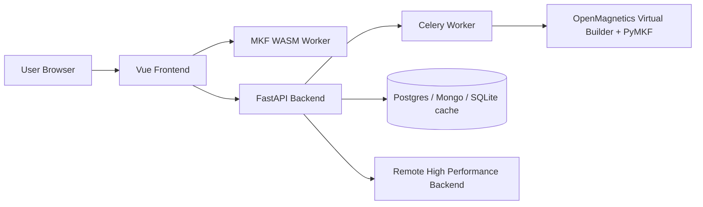
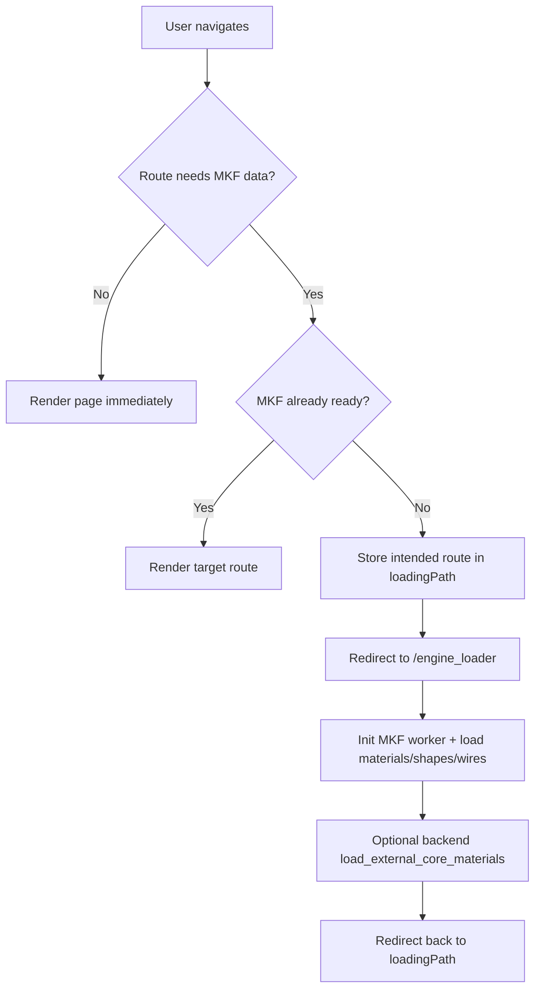
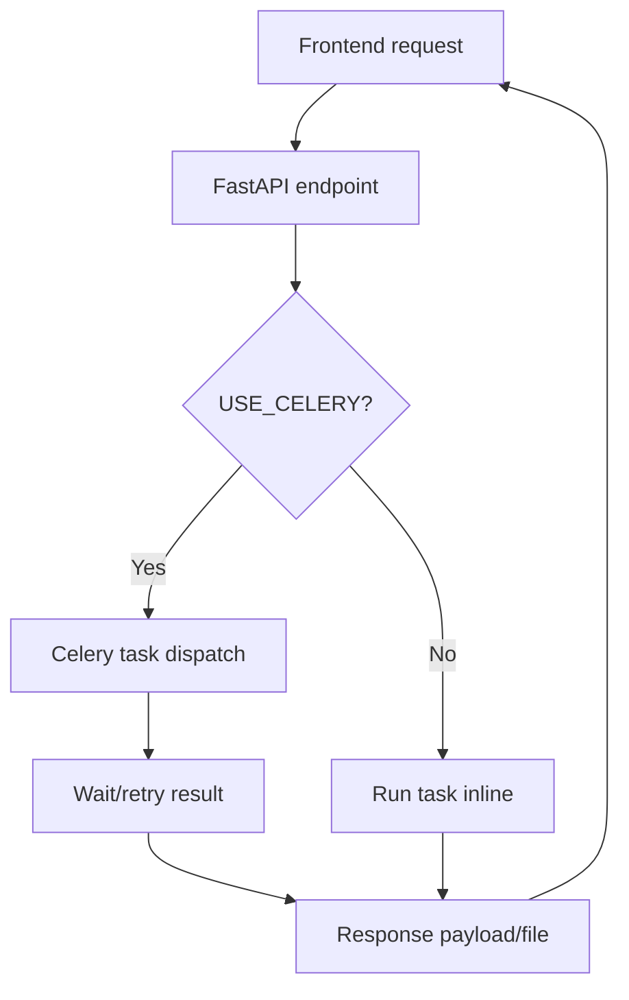
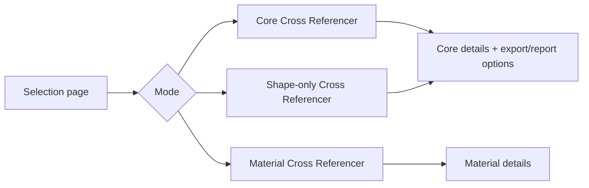
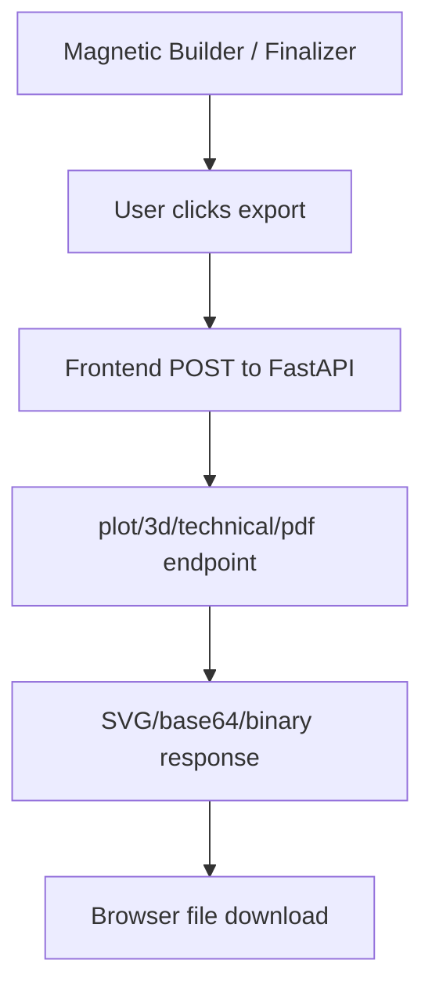

# Web Architecture and Website Workflows

Generated: 2026-02-21  
Scope: `PEEC_Script/WebFrontend-main` and `PEEC_Script/WebBackend-main` (static code analysis)

## 1. High-level Summary

The website is split into:

- **Frontend**: Vue 3 SPA (Vite + Pinia + Bootstrap), route-driven pages, heavy use of client-side MKF/WASM computation.
- **Backend**: FastAPI service for plotting, exports, PDF generation, notifications/bug reports, DB writes, and proxying high-performance remote simulation.
- **Async compute layer**: Celery + RabbitMQ for long plotting/geometry tasks (with local fallback if broker is unavailable).



## 2. Frontend Architecture

## 2.1 Stack

- Vue 3 + Vue Router
- Pinia (`state`, `style`, `settings`, `taskQueue`, etc.)
- Bootstrap + custom theme CSS (`src/assets/css/custom.css`)
- MKF runtime via Web Worker and WASM
- Lazy route components and wizard components

## 2.2 App Composition

- `src/main.js` handles:
  - App bootstrapping
  - Pinia persistence
  - MKF preload/init
  - Route guarding and redirects to `/engine_loader`
  - Theme store switching (standard vs Fair-Rite workflow)
- `src/App.vue` is a pure router shell (`<router-view/>`)
- Shared chrome:
  - `src/components/Header.vue`
  - `src/components/Footer.vue`

## 2.3 Core Runtime Workflow (Frontend)



## 3. Backend Architecture

## 3.1 Stack

- FastAPI (`api.py`)
- Celery worker tasks (`app/backend/plotter.py`)
- Data/model layer (`app/backend/models.py`, `app/backend/mas_models.py`)
- PyMKF and OpenMagneticsVirtualBuilder integration
- Optional DB access (Postgres and Mongo) and local plot cache (SQLite)

## 3.2 Backend Request Workflow



## 4. Page-by-Page Summary (What each page does + visual style)

| Route | Main view | Purpose | Visual style |
|---|---|---|---|
| `/` | `Home.vue` | Product entry page; launch builder, insulation, wizards | Hero + cards, dark gradient/image background, CTA-heavy |
| `/engine_loader` | `EngineLoader.vue` | Loading gate while MKF/data initialize | Minimal centered loading screen with GIF |
| `/cookie_policy` | `CookiePolicy.vue` | Cookie/legal text | Dense legal text in dark page |
| `/legal_notice` | `LegalNotice.vue` | Legal/privacy notice | Long legal article layout |
| `/magnetic_tool` | `MagneticTool.vue` | Main design workflow shell (`GenericTool`) | Workbench UI: storyline + control panel + tool modules |
| `/insulation_adviser` | `InsulationAdviser.vue` | Insulation-only workflow | Tool shell with dedicated insulation background |
| `/catalog_tool` | `CatalogTool.vue` | Catalog-assisted design flow | Same workbench shell with catalog storyline |
| `/catalog` | `Catalog.vue` | Catalog browser component | Simplified data/table page |
| `/magnetic_viewer` | `MagneticViewer.vue` | Read-only magnetic viewer mode | Workbench shell in viewer subsection |
| `/wizards_landing` | `WizardsLanding.vue` | Wizard picker / launcher | Grid of cards and buttons, "coming soon" section |
| `/wizards` | `Wizards.vue` | Renders selected wizard component | Dynamic wizard view container |
| `/cross_referencer_selection` | `CrossReferencerSelectionFairRite.vue` | Choose cross-reference mode | 3-option split layout; branded background |
| `/core_cross_referencer*` | `CrossReferencer*.vue` | Core/shape alternative finder | 3-step layout: inputs -> chart/table -> details |
| `/core_material_cross_referencer*` | `CrossReferencer*.vue` | Material alternative finder | Same 3-step explorer pattern |

`*` Includes generic and brand-specific variants (`fair_rite`, etc.).

## 5. Main User Workflows

## 5.1 Magnetic Builder Workflow

```mermaid
flowchart LR
    H[Home or Header] --> MT[/magnetic_tool]
    MT --> DR[Design Requirements]
    DR --> OP[Operating Points]
    OP --> MB[Magnetic Builder]
    MB --> SUM[Magnetic Summary]
    MB --> EXP[Export from Control Panel]
```

## 5.2 Catalog Workflow

```mermaid
flowchart LR
    H[Home/Header] --> CT[/catalog_tool]
    CT --> DR[Design Requirements]
    DR --> OP[Operating Points]
    OP --> CA[Catalog Adviser]
    CA --> MV[Magnetic Viewer]
    MV --> MB[Optional edit in Magnetic Builder]
```

## 5.3 Cross-Referencer Workflow



## 5.4 Wizards Workflow

```mermaid
flowchart LR
    WL[/wizards_landing] --> WSEL[Pick wizard type]
    WSEL --> W[/wizards]
    W --> GEN[Generate MAS inputs and op points]
    GEN --> NEXT{Next action}
    NEXT --> REV[Review in /magnetic_tool]
    NEXT --> ADV[Go directly to design section]
```

## 5.5 Export/Render Workflow (Frontend + Backend)



## 6. API Surface Used by Frontend

## 6.1 Confirmed in this backend repo

- `/get_notifications`
- `/report_bug`
- `/core_compute_shape_stl`, `/core_compute_shape_stp`
- `/core_compute_core_3d_model_stl`, `/core_compute_core_3d_model_stp`
- `/core_compute_gapping_technical_drawing`
- `/plot_core`, `/plot_core_and_fields`, `/plot_wire`, `/plot_wire_and_current_density`
- `/process_latex`
- `/insert_mas`, `/insert_intermediate_mas`
- `/load_external_core_materials`
- `/create_simulation_from_mas`
- `/is_high_performance_backend_available`

## 6.2 Referenced in frontend but not found in this backend folder

- `/calculate_advised_magnetics`
- `/operation_point_delete/{id}`
- `/core_compute_core_3d_model_obj`

This likely means those endpoints are expected from another backend service/repo variant.

## 7. Styling and Visual System

- Base theme is dark and driven by Bootstrap CSS variables in `custom.css`.
- UI style is also programmatically generated by Pinia style stores:
  - `style.js` (default theme)
  - `fairRiteStyle.js` (brand-specific theme variant)
- Many pages use full-screen background images + gradient overlays for brand/section identity.
- Workbench pages rely on reusable components (`GenericTool`, `Storyline`, `ControlPanel`, adviser modules).

## 8. Known Structural Notes

- Frontend depends on git submodules:
  - `WebSharedComponents`
  - `MagneticBuilder`
- In this worktree snapshot, those folders are missing, so some deeper component logic is external to the local tree.
- Still, route-level architecture and page workflows are clear from the available wrappers and store orchestration.

## 9. Practical "How the website works" in one paragraph

Users enter through the home page, pick a workflow (builder, wizard, insulation, catalog, or cross-reference), and are routed through state-driven tool stages managed by `GenericTool` and Pinia stores. Most magnetic calculations run client-side in MKF/WASM, while FastAPI handles rendering/export/document tasks and a few persistence/integration endpoints. For expensive geometry/plotting, backend tasks can run through Celery, and exports return downloadable files directly to the browser.

