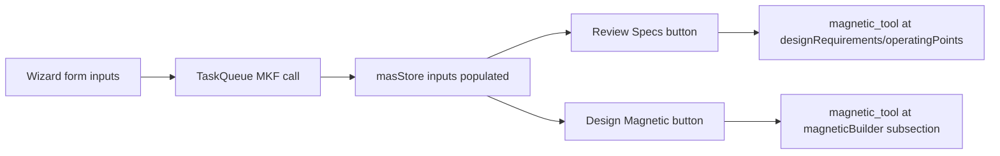

# Wizard Workflow Deep Dive

Generated: 2026-02-21  
Scope: `PEEC_Script/WebFrontend-main` + `PEEC_Script/WebBackend-main` (wizard-specific)

## 1. What This Covers

This document focuses only on wizard-related UX and logic:

- Where users can launch wizards
- How wizard selection/routing works
- Every wizard page, its buttons, and option sets
- What each button triggers in code
- How wizard outputs flow into `magnetic_tool`
- Visual styling/layout system for wizard pages
- Gaps/inconsistencies discovered in current implementation

---

## 2. Wizard Entry Surfaces

## 2.1 Home page entry

- `Home.vue` has a Design Wizards card with button:
  - Label: `Launch Wizards`
  - Handler: `onWizardsLanding`
  - Route: `/wizards_landing`

Reference: `PEEC_Script/WebFrontend-main/src/views/Home.vue:45`, `PEEC_Script/WebFrontend-main/src/views/Home.vue:142`

## 2.2 Dedicated Wizard Landing page

`WizardsLanding.vue` provides card-style launch buttons (`Start Wizard`) for:

- Common Mode Choke
- Differential Mode Choke
- Flyback
- Buck
- Boost
- Push-Pull
- PFC
- Isolated Buck
- Single-Switch Forward
- Two-Switch Forward
- Active Clamp Forward

Each card handler does:

1. `resetMagneticTool()`
2. `selectWorkflow("design")`
3. `selectWizard(...)`
4. route push to `/wizards`

References: `PEEC_Script/WebFrontend-main/src/views/WizardsLanding.vue:8`, `PEEC_Script/WebFrontend-main/src/views/WizardsLanding.vue:108`

## 2.3 Header dropdown (global shortcut)

`Header.vue` has a `Wizards` dropdown with direct entries for all wizard enums, including items marked as “new style”:

- CMC, DMC, Flyback, Buck, Boost, Isolated Buck, Isolated Buck-Boost, Push-Pull, PFC, DAB, LLC, CLLC, PSFB, Active Clamp Forward, Single-Switch Forward, Two-Switch Forward

Handler: `onWizards(wizard)` sets `selectedWizard` and routes to `/wizards`.

Important behavior:

- If already on `/wizards`, it sets `loadingPath` to `/wizards` and pushes `/engine_loader` to force re-entry.

References: `PEEC_Script/WebFrontend-main/src/components/Header.vue:82`, `PEEC_Script/WebFrontend-main/src/components/Header.vue:339`

---

## 3. Routing and Rendering Flow

## 3.1 Route map

- `/wizards_landing` -> `WizardsLanding.vue`
- `/wizards` -> `Wizards.vue`

Reference: `PEEC_Script/WebFrontend-main/src/router/index.js:53`

## 3.2 Wizard enum source of truth

Wizard IDs are in `state` store (`Wizards` object), including:

- `commonModeChoke`, `differentialModeChoke`, `flyback`, `buck`, `boost`, `isolatedBuck`, `isolatedBuckBoost`, `pushPull`, `singleSwitchForward`, `twoSwitchForward`, `activeClampForward`, `pfc`, `dualActiveBridge`, `llcResonant`, `cllcResonant`, `phaseShiftFullBridge`

Reference: `PEEC_Script/WebFrontend-main/src/stores/state.js:33`

## 3.3 Component dispatch in `Wizards.vue`

`Wizards.vue` conditionally renders one wizard component based on `getCurrentWizard()`.

Mappings include:

- `Buck` + `Boost` -> shared `BuckBoostWizard` with `converterName` prop
- `Single/Two/Active Clamp Forward` -> shared `ForwardWizard` with `converterName` prop
- `IsolatedBuck` + `IsolatedBuckBoost` -> shared `IsolatedBuckBoostWizard` with `converterName` prop

Reference: `PEEC_Script/WebFrontend-main/src/views/Wizards.vue:29`

## 3.4 Engine loader gating

`main.js` treats wizard routes as data-heavy (`loadData = true`), so if MKF is not ready it redirects to `/engine_loader` and returns to the intended route.

This affects both `/wizards_landing` and `/wizards`.

Reference: `PEEC_Script/WebFrontend-main/src/main.js:111`, `PEEC_Script/WebFrontend-main/src/main.js:129`

---

## 4. Website Workflow (Wizard Area)

```mermaid
flowchart TD
    A[Home: Launch Wizards] --> B[/wizards_landing]
    C[Header: Wizards dropdown] --> D[/wizards]
    B --> D

    D --> E{selectedWizard}
    E --> E1[CmcWizard]
    E --> E2[DmcWizard]
    E --> E3[Flyback/Buck/Boost/...]

    E1 --> F1[Process + Review/Design]
    E2 --> F2[Process + Review/Design]
    E3 --> F3[Process + Review/Design]

    F1 --> G[/magnetic_tool]
    F2 --> G
    F3 --> G
```



---

## 5. Shared Wizard Page UI System

Most converter wizards use `ConverterWizardBase.vue`.

## 5.1 Common layout

3-column structure:

- Column 1: design mode, design/switch parameters, conditions
- Column 2: input voltage, number of outputs, outputs
- Column 3: waveform viewer + controls

Reference: `PEEC_Script/WebFrontend-main/src/components/Wizards/ConverterWizardBase.vue:199`

## 5.2 Shared buttons and controls

- `Analytical` waveform button (`@get-analytical-waveforms`)
- `Simulated` waveform button (`@get-simulated-waveforms`)
- `Periods` selector (1..10)
- `Steady` selector (1..20)
- In wizard footer: `Review Specs`, `Design Magnetic`

Disable logic:

- Action buttons generally disabled when `errorMessage != ''`
- Waveform buttons disabled while simulating or when actions disabled

Reference: `PEEC_Script/WebFrontend-main/src/components/Wizards/ConverterWizardBase.vue:333`

## 5.3 Visual style

Main visual system:

- Gradient wizard header and icon badge
- Semi-transparent dark cards with theme-primary borders
- Primary/secondary action button variants
- Compact card styling for dense parameter entry

Reference: `PEEC_Script/WebFrontend-main/src/components/Wizards/ConverterWizardBase.vue:383`

Theme tokens used by wizard controls come from style store (`$styleStore.wizard.*`).

Reference: `PEEC_Script/WebFrontend-main/src/stores/style.js:607`

---

## 6. Wizard-by-Wizard: Buttons and Options

## 6.1 CMC Wizard (`CmcWizard.vue`)

Access:

- Landing card: yes
- Header dropdown: yes

Primary options and inputs:

- Number phases: `Two phases`, `Three phases`
- Main frequency
- Main RMS current
- Number of extra harmonics: `0..12`
- Harmonic list editor (frequency + amplitude pairs)
- Minimum inductance
- Number of impedance points: `0..12`
- Impedance point editor (frequency + impedance pairs)
- Ambient temperature
- Insulation type: `No`, `Basic`, `Reinforced`

Buttons:

- `Verify Impedance` (disabled on error, while simulating, or with zero impedance points)
- `I want to review the specification`
- `I want go directly to designing`

Special workflow:

- `Verify Impedance` calls `simulateCmcWaveforms(...)` and renders pass/fail table per frequency.

References:

- `PEEC_Script/WebFrontend-main/src/components/Wizards/CmcWizard.vue:32`
- `PEEC_Script/WebFrontend-main/src/components/Wizards/CmcWizard.vue:317`
- `PEEC_Script/WebFrontend-main/src/components/Wizards/CmcWizard.vue:611`

## 6.2 DMC Wizard (`DmcWizard.vue`)

Access:

- Landing card: yes
- Header dropdown: yes

Primary options and inputs:

- Configuration: `Single phase`, `Three phases`, `Three phases with neutral`
- Line frequency
- Operating current
- Minimum inductance
- Filter capacitance
- Number of attenuation points: `0..9`
- Attenuation point editor (frequency + required dB)
- Ambient temperature

Buttons:

- `Propose Design`
- `Verify Attenuation`
- `I want to review the specification`
- `I want go directly to designing`

Special workflow:

- `Propose Design` calls `proposeDmcDesign(...)` and fills proposed L/C/cutoff.
- `Verify Attenuation` calls `verifyDmcAttenuation(...)` and renders per-point pass/fail.

References:

- `PEEC_Script/WebFrontend-main/src/components/Wizards/DmcWizard.vue:31`
- `PEEC_Script/WebFrontend-main/src/components/Wizards/DmcWizard.vue:192`
- `PEEC_Script/WebFrontend-main/src/components/Wizards/DmcWizard.vue:470`

## 6.3 Flyback Wizard (`FlybackWizard.vue`)

Access:

- Landing card: yes
- Header dropdown: yes

Design mode options:

- `Help me with the design`
- `I know the design I want`

Other options:

- MOSFET input mode: `Its maximum duty cycle`, `Its maximum drain-source voltage`
- Insulation: `No`, `Basic`, `Reinforced`
- Number of outputs: `1..10`

Core inputs include:

- Inductance, duty cycle (with tolerance), dead time, max duty, max Vds
- Switching frequency, ambient temperature, diode drop, efficiency
- Input voltage (with tolerance)
- Outputs: voltage/current/turns ratio

Buttons:

- `Analytical`, `Simulated`, `Review Specs`, `Design Magnetic`

Engine calls:

- `calculateFlybackInputs`, `calculateAdvancedFlybackInputs`
- `simulateFlybackIdealWaveforms`

Reference: `PEEC_Script/WebFrontend-main/src/components/Wizards/FlybackWizard.vue:33`

## 6.4 Buck/Boost Wizard (`BuckBoostWizard.vue`)

Access:

- Landing cards: Buck + Boost
- Header dropdown: Buck + Boost

Design mode options:

- `Help me with the design`
- `I know the design I want`

Current sizing options:

- `The output current ratio`
- `The maximum switch current`

Core inputs:

- Inductance, max switch current, ripple ratio
- Switching frequency, ambient temperature, diode drop, efficiency
- Input voltage (tolerance), output voltage/current

Buttons:

- `Analytical`, `Simulated`, `Review Specs`, `Design Magnetic`

Engine calls:

- Buck: `calculateBuckInputs`, `calculateAdvancedBuckInputs`, `simulateBuckIdealWaveforms`
- Boost: `calculateBoostInputs`, `calculateAdvancedBoostInputs`, `simulateBoostIdealWaveforms`

Reference: `PEEC_Script/WebFrontend-main/src/components/Wizards/BuckBoostWizard.vue:39`

## 6.5 Isolated Buck / Isolated Buck-Boost (`IsolatedBuckBoostWizard.vue`)

Access:

- Landing: Isolated Buck only
- Header: Isolated Buck + Isolated Buck-Boost

Design mode options:

- `Help me with the design`
- `I know the design I want`

Current options:

- `The on-resistance of the MOSFET`
- `The maximum switch current`

Other options:

- Insulation: `No`, `Basic`, `Reinforced`
- Number outputs: `1..10`

Core inputs:

- Inductance, duty cycle tolerance, dead time
- MOSFET on-resistance or max switch current
- Switching frequency, ambient temp, diode drop, efficiency
- Input voltage tolerance, per-output voltage/current/turns ratio

Buttons:

- `Analytical`, `Simulated`, `Review Specs`, `Design Magnetic`

Engine calls:

- Isolated Buck: `calculate(IsolatedBuck|AdvancedIsolatedBuck)Inputs`, `simulateIsolatedBuckIdealWaveforms`
- Isolated Buck-Boost: `calculate(IsolatedBuckBoost|AdvancedIsolatedBuckBoost)Inputs`, `simulateIsolatedBuckBoostIdealWaveforms`

Reference: `PEEC_Script/WebFrontend-main/src/components/Wizards/IsolatedBuckBoostWizard.vue:39`

## 6.6 Push-Pull Wizard (`PushPullWizard.vue`)

Access:

- Landing card: yes
- Header dropdown: yes

Options:

- Design mode: help vs explicit
- Insulation: `No`, `Basic`, `Reinforced`
- Number outputs: `1..10`

Core inputs:

- Inductance, duty cycle, ripple
- Switching frequency, ambient temp, diode drop, efficiency
- Input voltage tolerance, outputs list

Buttons:

- `Analytical`, `Simulated`, `Review Specs`, `Design Magnetic`

Engine calls:

- `calculatePushPullInputs`, `calculateAdvancedPushPullInputs`, `simulatePushPullIdealWaveforms`

Reference: `PEEC_Script/WebFrontend-main/src/components/Wizards/PushPullWizard.vue:39`

## 6.7 Forward family (`ForwardWizard.vue`)

Access:

- Landing: Single-Switch, Two-Switch, Active Clamp
- Header: all three

Options:

- Design mode: help vs explicit
- Insulation: `No`, `Basic`, `Reinforced`
- Number outputs: `1..10`
- Topology selected via `converterName` prop

Core inputs:

- Inductance, duty cycle tolerance (explicit-design mode)
- Switching frequency, ambient temp, diode drop, efficiency
- Input voltage tolerance, output list

Buttons:

- `Analytical`, `Simulated`, `Review Specs`, `Design Magnetic`

Engine calls:

- Inputs: `calculate(SingleSwitch|TwoSwitch|ActiveClamp)ForwardInputs`
- Advanced inputs: matching `calculateAdvanced*`
- Simulation: `simulateForwardIdealWaveforms`, `simulateTwoSwitchForwardIdealWaveforms`, `simulateActiveClampForwardIdealWaveforms`

Reference: `PEEC_Script/WebFrontend-main/src/components/Wizards/ForwardWizard.vue:19`

## 6.8 PFC Wizard (`PfcWizard.vue`)

Access:

- Landing card: yes
- Header dropdown: yes

Options:

- Design mode: help vs explicit
- Mode: `Continuous`, `Critical`, `Discontinuous` conduction
- Ripple ratio field shown only in CCM (`isCcmMode`)

Core inputs:

- Inductance (explicit-design mode)
- Switching frequency, line frequency, ambient temp, diode drop, efficiency
- Input voltage tolerance, output voltage, output power

Buttons:

- `Analytical`, `Simulated`, `Review Specs`, `Design Magnetic`

Engine path differs:

- Uses `waitForMkf()` directly in component for `calculate_pfc_inputs` and `simulate_pfc_waveforms`.

Reference: `PEEC_Script/WebFrontend-main/src/components/Wizards/PfcWizard.vue:95`

## 6.9 DAB Wizard (`DabWizard.vue`)

Access:

- Landing: marked coming soon
- Header: available

Options:

- Insulation: `No`, `Basic`, `Reinforced`
- Checkbox: `Use Leakage L`

Core inputs:

- Switching frequency, phase shift, ambient temp, efficiency
- Turns ratio, magnetizing inductance, series inductance
- Input voltage tolerance, output voltage, output power

Buttons:

- `Analytical`, `Simulated`, `Review Specs`, `Design Magnetic`

Engine calls:

- `calculateDabInputs` used for both analytical and simulated button paths.

Reference: `PEEC_Script/WebFrontend-main/src/components/Wizards/DabWizard.vue:257`

## 6.10 LLC Wizard (`LlcWizard.vue`)

Access:

- Landing: marked coming soon
- Header: available

Options:

- Design mode radio: `Help me with the design` / `I know the design I want`
- Bridge type: `Half Bridge` / `Full Bridge`
- Checkbox: `Integrated Res L`
- Insulation: `No`, `Basic`, `Reinforced`

Core inputs:

- Quality factor, turns ratio, magnetizing inductance
- Min/max switching freq, resonant freq, ambient temp, efficiency
- Input voltage tolerance, output voltage, output power

Buttons:

- `Analytical`, `Simulated`, `Review Specs`, `Design Magnetic`

Engine calls:

- `calculateLlcInputs`, `simulateLlcIdealWaveforms`

Reference: `PEEC_Script/WebFrontend-main/src/components/Wizards/LlcWizard.vue:24`

## 6.11 CLLC Wizard (`CllcWizard.vue`)

Access:

- Landing: marked coming soon
- Header: available

Options:

- Insulation: `No`, `Basic`, `Reinforced`
- Checkboxes: `Bidirectional`, `Symmetric Tank`

Core inputs:

- Min/max switching freq, resonant freq, ambient temp, efficiency
- Q factor, turns ratio, magnetizing inductance
- Input voltage tolerance, output voltage, output power

Buttons:

- `Analytical`, `Simulated`, `Review Specs`, `Design Magnetic`

Engine calls:

- `calculateCllcInputs` is used for both analytical and simulated flows.

Reference: `PEEC_Script/WebFrontend-main/src/components/Wizards/CllcWizard.vue:237`

## 6.12 PSFB Wizard (`PsfbWizard.vue`)

Access:

- Landing: marked coming soon
- Header: available

Options:

- Insulation: `No`, `Basic`, `Reinforced`
- Rectifier: `Full Bridge`, `Center Tapped`, `Current Doubler`
- Checkbox: `Use Leakage L`

Core inputs:

- Switching frequency, phase shift, max phase shift
- Ambient temp, efficiency
- Turns ratio, magnetizing inductance, series inductance
- Input voltage tolerance, output voltage, output power

Buttons:

- `Analytical`, `Simulated`, `Review Specs`, `Design Magnetic`

Engine calls:

- `calculatePsfbInputs` used for both analytical and simulated flows.

Reference: `PEEC_Script/WebFrontend-main/src/components/Wizards/PsfbWizard.vue:271`

---

## 7. Review vs Design Magnetic Workflow

Both CTA paths start from wizard-specific `process()` and then diverge:

- `Review Specs`:
  - opens `magnetic_tool` with design requirements + operating points progression
- `Design Magnetic`:
  - sets current subsection to `magneticBuilder` before navigation

Common state setup usually includes:

- `resetMagneticTool()`
- `designLoaded()`
- `selectApplication(...)`
- `selectWorkflow("design")`
- `selectTool("agnosticTool")`
- enable can-continue flags for `designRequirements` and `operatingPoints`
- initialize `operatingPoints.modePerPoint`

```mermaid
flowchart TD
    P[process()] --> S[Populate masStore inputs]
    S --> R[Review Specs]
    S --> D[Design Magnetic]
    R --> R1[set statuses only]
    D --> D1[setCurrentToolSubsection = magneticBuilder]
    R1 --> M[/magnetic_tool]
    D1 --> M
```

---

## 8. MKF/Computation Path (Frontend vs Backend)

Wizard computations are frontend MKF/WASM-driven via `taskQueue` or direct MKF calls.

- `taskQueue` wrappers call MKF functions like `calculate_*_inputs` and `simulate_*_ideal_waveforms`.
- PFC uses direct `waitForMkf()` function calls inside the wizard component.

No dedicated wizard endpoints are exposed in `WebBackend-main/api.py`.

The backend is still used globally (e.g., `/load_external_core_materials` during engine-loader boot), but not as a direct wizard compute API.

References:

- `PEEC_Script/WebFrontend-main/src/stores/taskQueue.js:582`
- `PEEC_Script/WebFrontend-main/src/components/Wizards/PfcWizard.vue:95`
- `PEEC_Script/WebBackend-main/api.py:487`

---

## 9. Important Gaps and Inconsistencies

1. Landing vs Header mismatch:
- Landing says LLC/PSFB/DAB are “Coming Soon”, but header exposes them directly and `Wizards.vue` can render them.
- `WizardsLanding.vue` includes `onIsolatedBuckBoostWizard()` method but no visible card.

2. CMC async race risk:
- `processAndReview()` and `processAndAdvise()` call `this.process();` without `await`.
- Navigation can occur before process completion.

3. PSFB helper bug:
- `_buildAux()` returns before `numberOfPeriods`/`numberOfSteadyStatePeriods` assignments, making those lines unreachable.

4. Simulated-vs-analytical path overlap:
- CLLC, DAB, and PSFB “Simulated” flows currently call the same calculation method family rather than distinct simulate methods.

5. Forward UI/parameter mismatch:
- `ForwardWizard.process()` always uses `currentRippleRatio` and `maximumSwitchCurrent`, but UI mainly exposes inductance/duty/outputs/conditions, so some values rely on defaults.

6. Legacy wizard UI split:
- CMC and DMC still use older custom layout (not `ConverterWizardBase`), so look/behavior differs from the converter wizard family.

7. Header launch path does not reset tool state:
- `onWizards(...)` only sets wizard selection and route; unlike landing methods, it does not call `resetMagneticTool()`.

8. Minor encoding artifacts:
- Some labels/formatters display `µ`/`Ω` style mojibake in source strings.

---

## 10. Wizard Button Catalog (Quick Reference)

Global launch buttons:

- `Home`: `Launch Wizards`
- `WizardsLanding`: `Start Wizard` (per card), `Open Magnetic Builder`
- `Header`: one button per wizard in dropdown

Common in most converter wizards:

- `Analytical`
- `Simulated`
- `Review Specs`
- `Design Magnetic`

CMC-only action button:

- `Verify Impedance`

DMC-only action buttons:

- `Propose Design`
- `Verify Attenuation`

---

## 11. File Index (Wizard Area)

Core wiring:

- `PEEC_Script/WebFrontend-main/src/router/index.js`
- `PEEC_Script/WebFrontend-main/src/main.js`
- `PEEC_Script/WebFrontend-main/src/stores/state.js`
- `PEEC_Script/WebFrontend-main/src/views/WizardsLanding.vue`
- `PEEC_Script/WebFrontend-main/src/views/Wizards.vue`
- `PEEC_Script/WebFrontend-main/src/components/Header.vue`
- `PEEC_Script/WebFrontend-main/src/components/Wizards/ConverterWizardBase.vue`
- `PEEC_Script/WebFrontend-main/src/stores/taskQueue.js`

Wizard components:

- `PEEC_Script/WebFrontend-main/src/components/Wizards/CmcWizard.vue`
- `PEEC_Script/WebFrontend-main/src/components/Wizards/DmcWizard.vue`
- `PEEC_Script/WebFrontend-main/src/components/Wizards/FlybackWizard.vue`
- `PEEC_Script/WebFrontend-main/src/components/Wizards/BuckBoostWizard.vue`
- `PEEC_Script/WebFrontend-main/src/components/Wizards/IsolatedBuckBoostWizard.vue`
- `PEEC_Script/WebFrontend-main/src/components/Wizards/PushPullWizard.vue`
- `PEEC_Script/WebFrontend-main/src/components/Wizards/ForwardWizard.vue`
- `PEEC_Script/WebFrontend-main/src/components/Wizards/PfcWizard.vue`
- `PEEC_Script/WebFrontend-main/src/components/Wizards/DabWizard.vue`
- `PEEC_Script/WebFrontend-main/src/components/Wizards/LlcWizard.vue`
- `PEEC_Script/WebFrontend-main/src/components/Wizards/CllcWizard.vue`
- `PEEC_Script/WebFrontend-main/src/components/Wizards/PsfbWizard.vue`
