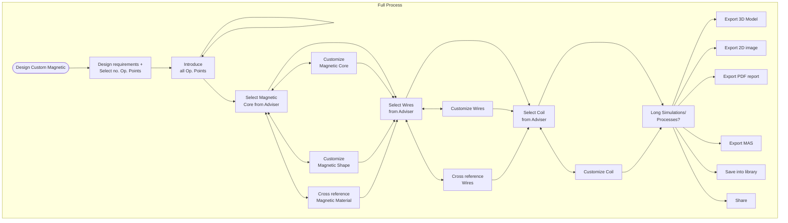
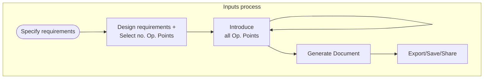
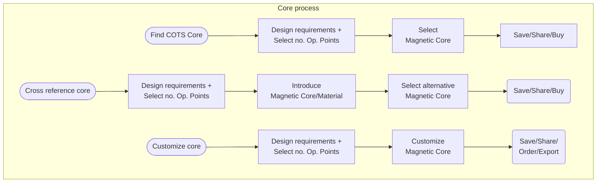
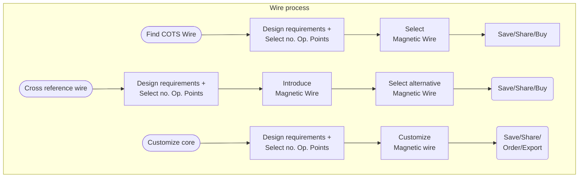
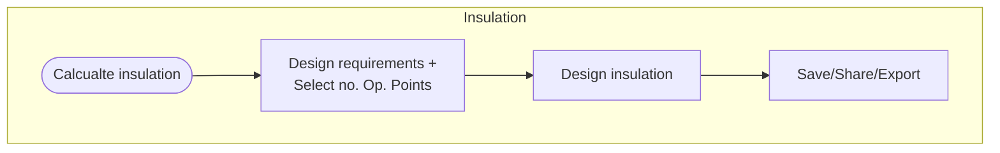

# WebFrontend

This project holds the code of the openmagnetics.com web frontend, written in Vue. 

```mermaid
flowchart TD
    subgraph "Full Process"
        0A([Design Custom Magnetic]) --> 0B[Design requirements + \n Select no. Op. Points]
        0B --> 0C[Introduce \n all Op. Points]
        0C --> 0C
        0C --> 0D0[Select Magnetic\nCore from Adviser]
        0D0 <--> 0D1[Customize \nMagnetic Core]
        0D0 <--> 0D2[Customize \nMagnetic Shape]
        0D0 <--> 0D3[Cross reference \nMagnetic Material]
        0D0 --> 0E0[Select Wires\nfrom Adviser]
        0D1 --> 0E0[Select Wires\nfrom Adviser]
        0D2 --> 0E0[Select Wires\nfrom Adviser]
        0D3 --> 0E0[Select Wires\nfrom Adviser]
        0E0 <--> 0E1[Customize Wires]
        0E0 <--> 0E2[Cross reference\nWires]
        0E0 --> 0F0[Select Coil\nfrom Adviser]
        0E1 --> 0F0[Select Coil\nfrom Adviser]
        0E2 --> 0F0[Select Coil\nfrom Adviser]
        0F0 <--> 0F1[Customize Coil]
        0F0 --> 0G[Long Simulations/\nProcesses?]
        0F1 --> 0G[Long Simulations/\nProcesses?]
        0G --> 0H0[Export 3D Model]
        0G --> 0H1[Export 2D image]
        0G --> 0H2[Export PDF report]
        0G --> 0H3[Export MAS]
        0G --> 0H4[Save into library]
        0G --> 0H5[Share]
    end
```

```mermaid
flowchart TD
    subgraph "Inputs process"
        1A([Specify requirements\n]) --> 1B[Design requirements + \n Select no. Op. Points]
        1B --> 1C[Introduce \n all Op. Points]
        1C --> 1C
        1C --> 1D[Generate Document]
        1D --> 1H[Export/Save/Share]
    end
```

```mermaid
flowchart TD
    subgraph "Core process"
        2A([Find COTS Core\n]) --> 2C[Design requirements + \n Select no. Op. Points]
        2C --> 2D[Select  \nMagnetic Core]
        2D --> 2H[Save/Share/Buy]

        
        3A([Cross reference core\n]) --> 3C[Design requirements + \n Select no. Op. Points]
        3C --> 3D[Introduce  \nMagnetic Core/Material]
        3D --> 3E[Select alternative  \nMagnetic Core]
        3E --> 3H(Save/Share/Buy)

        4A([Customize core\n]) --> 4C[Design requirements + \n Select no. Op. Points]
        4C --> 4D[Customize  \nMagnetic Core]
        4D --> 4H(Save/Share/\nOrder/Export)
    end
```

```mermaid
flowchart TD 
    subgraph "Wire process"
        5A([Find COTS Wire\n]) --> 5C[Design requirements + \n Select no. Op. Points]
        5C --> 5D[Select \nMagnetic Wire]
        5D --> 5H[Save/Share/Buy]
        
        6A([Cross reference wire\n]) --> 6C[Design requirements + \n Select no. Op. Points]
        6C --> 6D[Introduce \nMagnetic Wire]
        6D --> 6E[Select alternative  \nMagnetic Wire]
        6E --> 6H(Save/Share/Buy)

        7A([Customize core\n]) --> 7C[Design requirements + \n Select no. Op. Points]
        7C --> 7D[Customize  \nMagnetic wire]
        7D --> 7H(Save/Share/\nOrder/Export)
    end
```

```mermaid
flowchart TD    
    subgraph "Insulation"
        8A([Calcualte insulation\n]) --> 8C[Design requirements + \n Select no. Op. Points]
        8C --> 8D[Design insulation]
        8D --> 8H[Save/Share/Export]
        
    end
```
