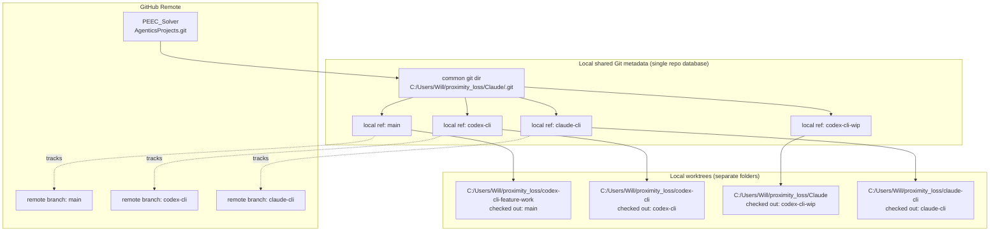

# AgenticsProjects Worktree Map

## How changes flow from this worktree

1. You edit files in `C:/Users/Will/proximity_loss/codex-cli-feature-work`.
2. You commit on `main` in this worktree.
3. The shared local `main` ref in `C:/Users/Will/proximity_loss/Claude/.git` moves to the new commit.
4. When pushed, `PEEC_Solver/main` on `AgenticsProjects.git` moves to that commit.

## What happens on merge

1. If you merge another branch into `main` from this worktree, local `main` advances.
2. Pushing updates `PEEC_Solver/main` on GitHub.
3. Other worktrees see the new commit after fetch/pull or when checked out to it.
